> mysql的执行计划可以清楚地知道sql的执行顺序、type、可能用到的索引、扫描的行数、等等。针对于执行计划所查询出的问题，我们该如何优化呢？以及平时我们在写sql时需要注意什么？针对索引失效的情况我们该如何解决呢？

<!-- more -->

## 尽量全值匹配
```mysql
CREATE TABLE `staffs` (
	id INT PRIMARY KEY auto_increment,
	NAME VARCHAR (24) NOT NULL DEFAULT "" COMMENT '姓名',
	age INT NOT NULL DEFAULT 0 COMMENT '年龄',
	pos VARCHAR (20) NOT NULL DEFAULT "" COMMENT '职位',
	add_time TIMESTAMP NOT NULL DEFAULT CURRENT_TIMESTAMP COMMENT '入职时间'
) charset utf8 COMMENT '员工记录表';

```
```mysql
insert into staffs(name,age,pos,add_time) values('z3',22,'manage',now());
insert into staffs(name,age,pos,add_time) values('july',23,'dev',now());
insert into staffs(name,age,pos,add_time) values('2000',23,'dev',now());
 
alter table staffs add index idx_staffs_nameAgePos(name,age,pos);

```

---

```mysql
EXPLAIN SELECT
	*
FROM
	staffs
WHERE
	NAME = 'July';
```
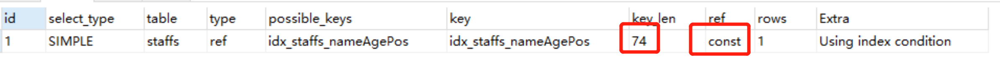

---

```
EXPLAIN SELECT
	*
FROM
	staffs
WHERE
	NAME = 'July'
AND age = 25;
```


---

```
EXPLAIN SELECT
	*
FROM
	staffs
WHERE
	NAME = 'July'
AND age = 25
AND pos = 'dev'
```
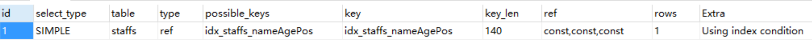

---
> 当建立了索引列后，能在where条件中使用索引的尽量所用。

## 最佳左前缀法则
> 如果索引了多列，要遵守最左前缀法则。指的是查询从索引的最左前列开始并且不跳过索引中的列。

---

```
EXPLAIN SELECT
	*
FROM
	staffs
WHERE
	age = 25
AND pos = 'dev'
```
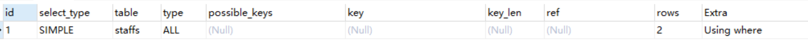

---

```
EXPLAIN SELECT
	*
FROM
	staffs
WHERE
	pos = 'dev'
```
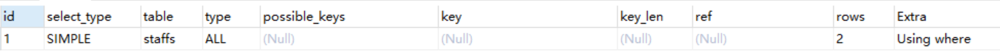

---

```
EXPLAIN SELECT
	*
FROM
	staffs
WHERE
	NAME = 'July'
```
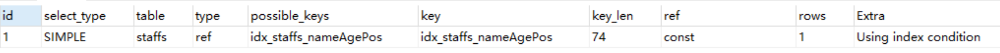

---

## 不在索引列上做任何操作
> 不在索引列上做任何操作（计算、函数、(自动or手动)类型转换），会导致索引失效而转向全表扫描。
```
EXPLAIN SELECT
	*
FROM
	staffs
WHERE
	LEFT (NAME, 4) = 'July';

```
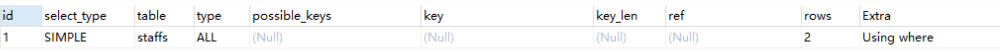

## 范围条件放最后

```
EXPLAIN SELECT * FROM staffs WHERE NAME = 'July' ;
EXPLAIN SELECT * FROM staffs WHERE NAME = 'July'  and age =22;
EXPLAIN SELECT * FROM staffs WHERE NAME = 'July'  and age =22 and pos='manager';

//中间有范围导致后面的索引都失效
EXPLAIN SELECT * FROM staffs WHERE NAME = 'July'  and age >22 and pos='manager';

```
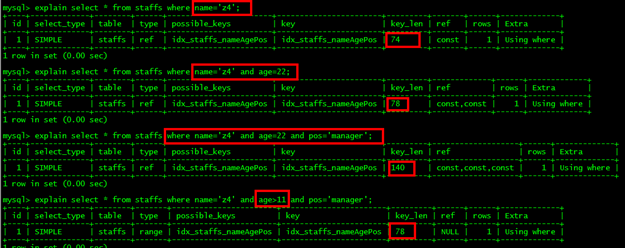

## 覆盖索引尽量用

> 尽量使用覆盖索引(只访问索引的查询(索引列和查询列一致))，减少select *。

```
EXPLAIN SELECT * FROM staffs WHERE NAME = 'July'  and age =22 and pos='manager';

EXPLAIN SELECT name,age,pos FROM staffs WHERE NAME = 'July'  and age =22 and pos='manager';

EXPLAIN SELECT * FROM staffs WHERE NAME = 'July'  and age >22 and pos='manager';

EXPLAIN SELECT name,age,pos FROM staffs WHERE NAME = 'July'  and age >22 and pos='manager';

```
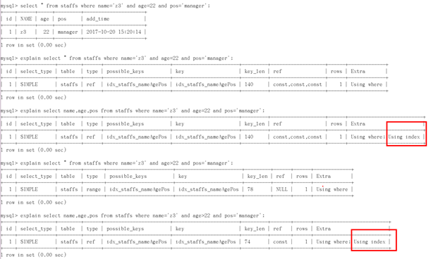

## 不等于要慎用

> mysql 在使用不等于(!= 或者<>)的时候无法使用索引会导致全表扫描。

```
EXPLAIN SELECT * FROM staffs WHERE NAME = 'July';

EXPLAIN SELECT * FROM staffs WHERE NAME != 'July';

EXPLAIN SELECT * FROM staffs WHERE NAME <> 'July';

```
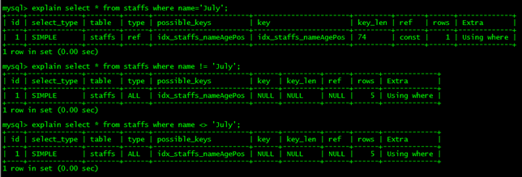

> 如果定要需要使用不等于,请用覆盖索引。

```
EXPLAIN SELECT name,age,pos FROM staffs WHERE NAME != 'July';

EXPLAIN SELECT name,age,pos FROM staffs WHERE NAME <> 'July';

```

## Null/Not 有影响

> 注意null/not null对索引的可能影响

### 自定定义为NOT NULL

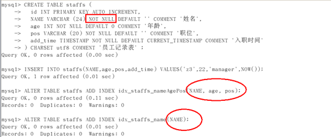
```
EXPLAIN select * from staffs where name is null;

EXPLAIN select * from staffs where name is not null;

```
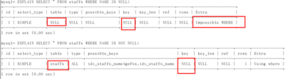

> 在字段为not null的情况下，使用is null 或 is not null 会导致索引失效。

**解决方案：覆盖索引**
```
EXPLAIN SELECT
	NAME,
	age,
	pos
FROM
	staffs
WHERE
	NAME IS NOT NULL;
```
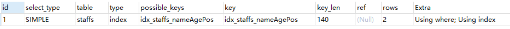

### 自定义为NULL或者不定义
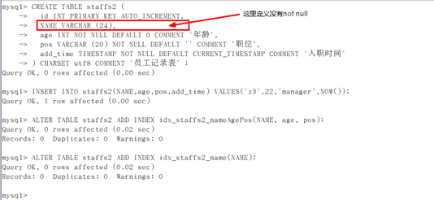

```
EXPLAIN SELECT
	*
FROM
	staffs2
WHERE
	NAME IS NULL;
```
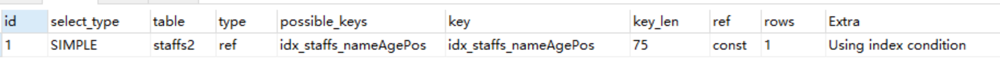

```
EXPLAIN SELECT
	*
FROM
	staffs2
WHERE
	NAME IS NOT NULL;
```
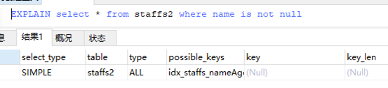

**解决方式：覆盖索引**
```
EXPLAIN SELECT
	NAME,
	age,
	pos
FROM
	staffs
WHERE
	NAME IS NOT NULL
```

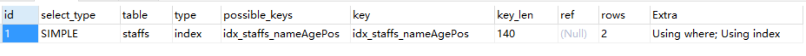

## like查询要当心

> like以通配符开头('%abc...')mysql索引失效会变成全表扫描的操作。

```
EXPLAIN select * from staffs where name ='july';

EXPLAIN select * from staffs where name like '%july%';

EXPLAIN select * from staffs where name like '%july';

EXPLAIN select * from staffs where name like 'july%';

```
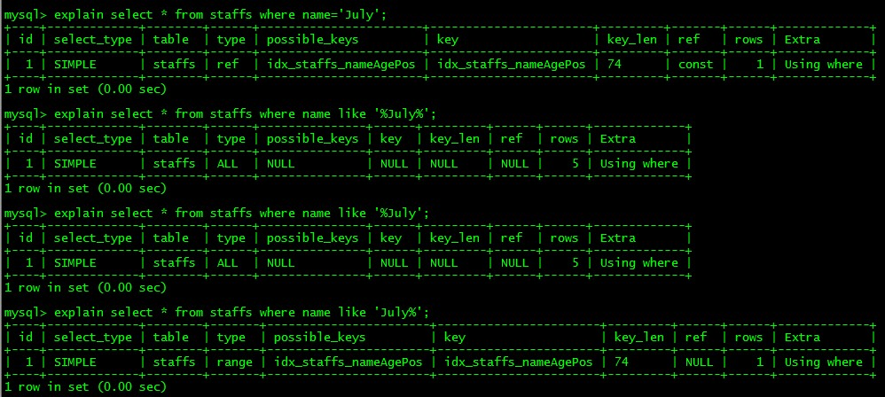

**解决方式：覆盖索引**

```mysql
EXPLAIN SELECT
	NAME,
	age,
	pos
FROM
	staffs
WHERE
	NAME LIKE '%july%';
```

## 字符类型加引号

> 字符串不加单引号索引失效。

```mysql
EXPLAIN SELECT
	*
FROM
	staffs
WHERE
	NAME = 917
```
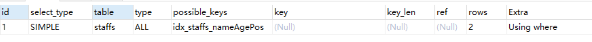

**解决方式：请加引号**

```mysql
EXPLAIN SELECT
	*
FROM
	staffs
WHERE
	NAME = '917'
```
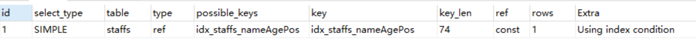

## OR改UNION效率高


```mysql
EXPLAIN SELECT
	*
FROM
	staffs
WHERE
	NAME = 'July'
OR NAME = 'z3';
```
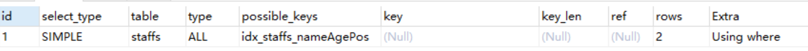

```mysql
EXPLAIN SELECT
	*
FROM
	staffs
WHERE
	NAME = 'July'
UNION
	SELECT
		*
	FROM
		staffs
	WHERE
		NAME = 'z3';
```
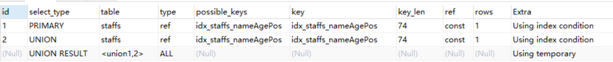

**解决方式：覆盖索引**
> 如果一定要用or，请使用覆盖索引

```mysql
EXPLAIN SELECT
	NAME,
	age
FROM
	staffs
WHERE
	NAME = 'July'
OR NAME = 'z3';
```
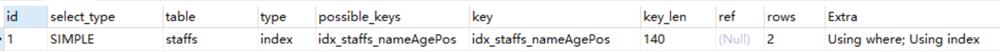

## 批量导入优化
### insert语句优化
- 提交前关闭自动提交；
- 尽量使用批量insert语句；
- 可以使用MyISAM存储引擎。

### LOAD DATA INFLIE
> 使用LOAD DATA INFLIE ,比一般的insert语句快20倍。

```
SELECT
	* INTO OUTFILE 'E:\\product.txt'
FROM
	product_info
```

```mysql
LOAD DATA INFILE 'E:\\product.txt' INTO TABLE product_info2
```