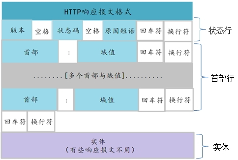

> 本文主要介绍网络编程的一些基础知识点，包括OSI七层模型、TCP/IP四层模型、网络协议族、TCP与UDP、TCP连接的三次握手和四次挥手、TCP/IP中的数据包以及数据包的传输过程、HTTP协议的报文结构及传输过程等。

<!-- more -->

# 1、OSI七层网络模型
## 1.1 什么是OSI七层模型
开放系统互连参考模型 (Open System Interconnect 简称OSI）是国际标准化组织(ISO)和国际电报电话咨询委员会(CCITT)联合制定的开放系统互连参考模型，为开放式互连信息系统提供了一种功能结构的框架。其目的是为异种计算机互连提供一个共同的基础和标准框架，并为保持相关标准的一致性和兼容性提供共同的参考。这里所说的开放系统，实质上指的是遵循OSI参考模型和相关协议能够实现互连的具有各种应用目的的计算机系统。

OSI采用了分层的结构化技术，共分七层，物理层、数据链路层、网络层、传输层、会话层、表示层、应用层。

## 1.2 OSI七层模型中各层的作用

层名 | 作用
---|---
应用层 | 网络服务与最终用户的一个接口
表示层 | 把应用层提供的信息变换为能够共同理解的形式
会话层 | 建立、管理、终止会话
传输层 | 定义传输数据的协议端口号，以及流控和差错校验
网络层 | 路由选择和中继，在一条数据链路上复用多条网络连接
数据链路层 | 数据链路的建立，拆除，对数据的检错，纠错是数据链路层的基本任务
物理层 | 物理层并不是物理媒体本身，它只是开放系统中利用物理媒体实现物理连接的功能描述和执行连接的规程

### 1.2.1 物理层
物理层并不是物理媒体本身，它只是开放系统中利用物理媒体实现物理连接的功能描述和执行连接的规程。

物理层的媒体包括架空明线、平衡电缆、光纤、无线信道等。通信用的互连设备指DTE（Data Terminal Equipment）和DCE（Data Communications Equipment）间的互连设备。DTE即数据终端设备，又称物理设备，如计算机、终端等都包括在内。而DCE则是数据通信设备或电路连接设备，如调制解调器等。数据传输通常是经过DTE-DCE，再经过DCE-DTE的路径。互连设备指将DTE、DCE连接起来的装置，如各种插头、插座。LAN中的各种粗、细同轴电缆、T型接头、插头、接收器、发送器、中继器等都属物理层的媒体和连接器。

**物理层的主要功能是：**
- 为数据端设备提供传送数据的通路，数据通路可以是一个物理媒体，也可以是多个物理媒体连接而成。一次完整的数据传输，包括激活物理连接、传送数据和终止物理连接。所谓激活，就是不管有多少物理媒体参与，都要在通信的两个数据终端设备间连接起来，形成一条通路。
- 传输数据。物理层要形成适合数据传输需要的实体，为数据传送服务。一是要保证数据能在其上正确通过，二是要提供足够的带宽(带宽是指每秒钟内能通过的比特(Bit)数)，以减少信道上的拥塞。传输数据的方式能满足点到点，一点到多点，串行或并行，半双工或全双工，同步或异步传输的需要。

### 1.2.2 数据链路层
数据链路可以粗略地理解为数据通道。物理层要为终端设备间的数据通信提供传输介质及其连接。介质是长期的，连接是有生存期的。在连接生存期内，收发两端可以进行不等的一次或多次数据通信。每次通信都要经过建立通信联络和拆除通信联络两个过程。这种建立起来的数据收发关系就叫做数据链路。而在物理媒体上传输的数据难免受到各种不可靠因素的影响而产生差错，为了弥补物理层上的不足，为上层提供无差错的数据传输，就要能对数据进行检错和纠错。

**数据链路层的主要功能：**
- 链路连接的建立、拆除和分离
- 差错检测和恢复。还有链路标识，流量控制等等

独立的链路产品中最常见的当属网卡，网桥也是链路产品。

### 1.2.3 网络层
网络层，当数据终端增多时，它们之间有中继设备相连，此时会出现一台终端要求不只是与惟一的一台而是能和多台终端通信的情况，这就产生了把任意两台数据终端设备的数据链接起来的问题，也就是路由或者叫寻径。另外，当一条物理信道建立之后，被一对用户使用，往往有许多空闲时间被浪费掉。人们自然会希望让多对用户共用一条链路，为解决这一问题就出现了逻辑信道技术和虚拟电路技术。

### 1.2.4 传输层
传输层有一个既存事实，即世界上各种通信子网在性能上存在着很大差异。例如电话交换网，分组交换网，公用数据交换网，局域网等通信子网都可互连，但它们提供的吞吐量，传输速率，数据延迟通信费用各不相同。对于会话层来说，却要求有一性能恒定的界面。传输层就承担了这一功能。

### 1.2.5 会话层
会话层会话单位的控制层，其主要功能是按照在应用进程之间约定的原则，按照正确的顺序收、发数据，进行各种形态的对话。会话层规定了会话服务用户间会话连接的建立和拆除规程以及数据传送规程。

会话层提供的服务是应用建立和维持会话，并能使会话获得同步。会话层使用校验点可使通信会话在通信失效时从校验点继续恢复通信。这种能力对于传送大的文件极为重要。

### 1.2.6 表示层
表示层其主要功能是把应用层提供的信息变换为能够共同理解的形式，提供字符代码、数据格式、控制信息格式、加密等的统一表示。表示层的作用之一是为异种机通信提供一种公共语言，以便能进行互操作。这种类型的服务之所以需要，是因为不同的计算机体系结构使用的数据表示法不同。

例如，IBM主机使用EBCDIC编码，而大部分PC机使用的是ASCII码。在这种情况下，便需要表示层来完成这种转换。

### 1.2.7 应用层
应用层向应用程序提供服务，这些服务按其向应用程序提供的特性分成组，并称为服务元素。有些可为多种应用程序共同使用，有些则为较少的一类应用程序使用。应用层是开放系统的最高层，是直接为应用进程提供服务的。其作用是在实现多个系统应用进程相互通信的同时，完成一系列业务处理所需的服务。

# 2、TCP/IP协议
Transmission Control Protocol/Internet Protocol的简写，中译名为传输控制协议/因特网互联协议，是Internet最基本的协议、Internet国际互联网络的基础，由网络层的IP协议和传输层的TCP协议组成。协议采用了4层的层级结构。然而在很多情况下，它是利用 IP 进行通信时所必须用到的协议群的统称。

> 通俗而言：TCP负责发现传输的问题，一有问题就发出信号，要求重新传输，直到所有数据安全正确地传输到目的地。而IP是给因特网的每一台联网设备规定一个地址。

## 2.1 TCP和UDP
- TCP 是面向连接的、可靠的流协议，通过三次握手建立连接，通讯完成时要拆除连接。
- UDP是面向无连接的通讯协议，UDP通讯时不需要接收方确认，属于不可靠的传输，可能会出现丢包现象。

### 2.1.1 TCP
TCP是面向连接的通信协议，通过==三次握手==建立连接，通讯完成时要拆除连接，由于TCP是面向连接的所以只能用于==端到端==的通讯。

TCP提供的是一种可靠的数据流服务，采用“带重传的肯定确认”技术来实现传输的可靠性。TCP还采用一种称为“滑动窗口”的方式进行流量控制，所谓窗口实际表示接收能力，用以限制发送方的发送速度。

如果IP数据包中有已经封好的TCP数据包，那么IP将把它们向‘上’传送到TCP层。TCP将包排序并进行错误检查，同时实现虚电路间的连接。TCP数据包中包括序号和确认，所以未按照顺序收到的包可以被排序，而损坏的包可以被重传。

TCP将它的信息送到更高层的应用程序，例如Telnet的服务程序和客户程序。应用程序轮流将信息送回TCP层，TCP层便将它们向下传送到IP层，设备驱动程序和物理介质，最后到接收方。

面向连接的服务（例如Telnet、FTP、rlogin、X Windows和SMTP）需要高度的可靠性，所以它们使用了TCP。DNS在某些情况下使用TCP（发送和接收域名数据库），但使用UDP传送有关单个主机的信息。

### 2.1.2 UDP
UDP是面向无连接的通讯协议，UDP数据包括目的端口号和源端口号信息，由于通讯不需要连接，所以可以实现广播发送。

UDP通讯时不需要接收方确认，属于不可靠的传输，可能会出现丢包现象，实际应用中要求程序员编程验证。

UDP与TCP位于同一层，但它不管数据包的顺序、错误或重发。因此，UDP不被应用于那些使用虚电路的面向连接的服务，UDP主要用于那些面向查询---应答的服务，例如NFS。相对于FTP或Telnet，这些服务需要交换的信息量较小。

使用UDP的服务包括1.NTP（网络时间协议）和DNS（DNS也使用TCP），包总量较少的通信（DNS、SNMP等）；2.视频、音频等多媒体通信（即时通信）；3.限定于 LAN 等特定网络中的应用通信；4.广播通信（广播、多播）。

常用QQ，就是一个以UDP为主，TCP为辅的通讯协议。

### 2.1.3 TCP和UDP的优缺点
无法简单地、绝对地去做比较：
- TCP 用于在传输层有必要实现可靠传输的情况；
- 而在一方面，UDP 主要用于那些对高速传输和实时性有较高要求的通信或广播通信。

TCP 和 UDP 应该根据应用的目的按需使用。

### 2.1.4 端口号
数据链路和 IP 中的地址，分别指的是 MAC 地址和 IP地址。前者用来识别同一链路中不同的计算机，后者用来识别 TCP/IP 网络中互连的主机和路由器。在传输层也有这种类似于地址的概念，那就是端口号。端口号用来识别同一台计算机中进行通信的不同应用程序。因此，它也被称为==程序地址==。

一台计算机上同时可以运行多个程序。传输层协议正是利用这些端口号识别本机中正在进行通信的应用程序，并准确地将数据传输。

**端口号的确定**
- 标准既定的端口号：这种方法也叫静态方法。它是指每个应用程序都有其指定的端口号。但并不是说可以随意使用任何一个端口号。例如 HTTP、FTP、TELNET 等广为使用的应用协议中所使用的端口号就是固定的。这些端口号被称为知名端口号，分布在 0~1023 之间；除知名端口号之外，还有一些端口号被正式注册，它们分布在 1024~49151 之间，不过这些端口号可用于任何通信用途。
- 时序分配法：服务器有必要确定监听端口号，但是接受服务的客户端没必要确定端口号。在这种方法下，客户端应用程序完全可以不用自己设置端口号，而全权交给操作系统进行分配。动态分配的端口号范围在 49152~65535 之间。

## 2.2 TCP的三次握手与四次挥手（分手）

### 2.2.1 三次握手（重要）

TCP 提供面向有连接的通信传输。面向有连接是指在数据通信开始之前先做好两端之间的准备工作。

所谓三次握手是指建立一个TCP连接时需要客户端和服务器端总共发送三个包以确认连接的建立。在socket编程中，这一过程由客户端执行connect来触发。

第一次握手：客户端将标志位SYN置为1，随机产生一个值seq=J，并将该数据包发送给服务器端，客户端进入SYN_SENT状态，等待服务器端确认。

第二次握手：服务器端收到数据包后由标志位SYN=1知道客户端请求建立连接，服务器端将标志位SYN和ACK都置为1，ack=J+1，随机产生一个值seq=K，并将该数据包发送给客户端以确认连接请求，服务器端进入SYN_RCVD状态。

第三次握手：客户端收到确认后，检查ack是否为J+1，ACK是否为1，如果正确则将标志位ACK置为1，ack=K+1，并将该数据包发送给服务器端，服务器端检查ack是否为K+1，ACK是否为1，如果正确则连接建立成功，客户端和服务器端进入ESTABLISHED状态，完成三次握手，随后客户端与服务器端之间可以开始传输数据了。

### 2.2.2 四次挥手（分手）

四次挥手即终止TCP连接，就是指断开一个TCP连接时，需要客户端和服务端总共发送4个包以确认连接的断开。在socket编程中，这一过程由客户端或服务端任一方执行close来触发。

由于TCP连接是全双工的，因此，每个方向都必须要单独进行关闭，这一原则是当一方完成数据发送任务后，发送一个FIN来终止这一方向的连接，收到一个FIN只是意味着这一方向上没有数据流动了，即不会再收到数据了，但是在这个TCP连接上仍然能够发送数据，直到这一方向也发送了FIN。首先进行关闭的一方将执行主动关闭，而另一方则执行被动关闭。

- A.客户端进程发出连接释放报文，并且停止发送数据。释放数据报文首部，FIN=1，其序列号为seq=u（等于前面已经传送过来的数据的最后一个字节的序号加1），此时，客户端进入FIN-WAIT-1（终止等待1）状态。 TCP规定，FIN报文段即使不携带数据，也要消耗一个序号。
- B.服务器收到连接释放报文，发出确认报文，ACK=1，ack=u+1，并且带上自己的序列号seq=v，此时，服务端就进入了CLOSE-WAIT（关闭等待）状态。TCP服务器通知高层的应用进程，客户端向服务器的方向就释放了，这时候处于半关闭状态，即客户端已经没有数据要发送了，但是服务器若发送数据，客户端依然要接受。这个状态还要持续一段时间，也就是整个CLOSE-WAIT状态持续的时间。
- C.客户端收到服务器的确认请求后，此时，客户端就进入FIN-WAIT-2（终止等待2）状态，等待服务器发送连接释放报文（在这之前还需要接受服务器发送的最后的数据）。
- D.服务器将最后的数据发送完毕后，就向客户端发送连接释放报文，FIN=1，ack=u+1，由于在半关闭状态，服务器很可能又发送了一些数据，假定此时的序列号为seq=w，此时，服务器就进入了LAST-ACK（最后确认）状态，等待客户端的确认。
- E.客户端收到服务器的连接释放报文后，必须发出确认，ACK=1，ack=w+1，而自己的序列号是seq=u+1，此时，客户端就进入了TIME-WAIT（时间等待）状态。注意此时TCP连接还没有释放，必须经过2∗MSL（最长报文段寿命）的时间后，当客户端撤销相应的TCB后，才进入CLOSED状态。
- F.服务器只要收到了客户端发出的确认，立即进入CLOSED状态。同样，撤销TCB后，就结束了这次的TCP连接。可以看到，服务器结束TCP连接的时间要比客户端早一些。

## 2.3 TCP/IP中的数据包
- 包是全能性术语；
- 帧用于表示数据链路层中包的单位；
- 片是 IP中数据的单位；
- 段则表示 TCP 数据流中的信息；
- 消息是指应用协议中数据的单位。

每个分层中，都会对所发送的数据附加一个首部，在这个首部中包含了该层必要的信息，如发送的目标地址以及协议相关信息。通常，为协议提供的信息为包首部，所要发送的内容为数据。在下一层的角度看，从上一层收到的包全部都被认为是本层的数据。

网络中传输的数据包由两部分组成：一部分是协议所要用到的首部，另一部分是上一层传过来的数据。首部的结构由协议的具体规范详细定义。在数据包的首部，明确标明了协议应该如何读取数据。反过来说，看到首部，也就能够了解该协议必要的信息以及所要处理的数据。

1. **应用程序处理：**

- 首先应用程序会进行编码处理，这些编码相当于 OSI 的表示层功能；
- 编码转化后，邮件不一定马上被发送出去，这种何时建立通信连接何时发送数据的管理功能，相当于 OSI 的会话层功能。

2. **TCP模块的处理：**
- TCP 根据应用的指示，负责建立连接、发送数据以及断开连接。
- TCP 提供将应用层发来的数据顺利发送至对端的可靠传输。为了实现这一功能，需要在应用层数据的前端附加一个 TCP 首部。

3. **IP模块的处理：**
- IP 将 TCP 传过来的 TCP 首部和 TCP 数据合起来当做自己的数据，并在 TCP 首部的前端加上自己的 IP 首部。
- IP 包生成后，参考路由控制表决定接受此 IP 包的路由或主机。

4. **网络接口（以太网驱动）的处理：**
- 从 IP 传过来的 IP 包对于以太网来说就是数据。
- 给这些数据附加上以太网首部并进行发送处理，生成的以太网数据包将通过物理层传输给接收端。

5. **网络接口（以太网驱动）的处理：**
- 主机收到以太网包后，首先从以太网包首部找到 MAC地址判断是否为发送给自己的包，若不是则丢弃数据。
- 如果是发送给自己的包，则从以太网包首部中的类型确定数据类型，再传给相应的模块，如 IP、ARP 等。这里的例子则是 IP 。

6. **IP模块处理：**
- IP 模块接收到数据后也做类似的处理。从包首部中判断此 IP 地址是否与自己的 IP 地址匹配，如果匹配则根据首部的协议类型将数据发送给对应的模块，如 TCP、UDP。这里的例子则是 TCP。
- 另外，对于有路由器的情况，接收端地址往往不是自己的地址，此时，需要借助路由控制表，在调查应该送往的主机或路由器之后再进行转发数据。

7.  **TCP 模块的处理：**
- 在 TCP 模块中，首先会计算一下校验和，判断数据是否被破坏。然后检查是否在按照序号接收数据。最后检查端口号，确定具体的应用程序。
- 数据被完整地接收以后，会传给由端口号识别的应用程序。

8.  **应用程序的处理：**
- 接收端应用程序会直接接收发送端发送的数据。通过解析数据，展示相应的内容。

## 2.4 TCP 中通过序列号与确认应答提高可靠性

在 TCP 中，当发送端的数据到达接收主机时，接收端主机会返回一个已收到消息的通知。这个消息叫做确认应答（ACK）。当发送端将数据发出之后会等待对端的确认应答。如果有确认应答，说明数据已经成功到达对端。反之，则数据丢失的可能性很大。

在一定时间内没有等待到确认应答，发送端就可以认为数据已经丢失，并进行重发。由此，即使产生了丢包，仍然能够保证数据能够到达对端，实现可靠传输。

未收到确认应答并不意味着数据一定丢失。也有可能是数据对方已经收到，只是返回的确认应答在途中丢失。这种情况也会导致发送端误以为数据没有到达目的地而重发数据。

此外，也有可能因为一些其他原因导致确认应答延迟到达，在源主机重发数据以后才到达的情况也屡见不鲜。此时，源主机只要按照机制重发数据即可。

对于目标主机来说，反复收到相同的数据是不可取的。为了对上层应用提供可靠的传输，目标主机必须放弃重复的数据包。为此我们引入了序列号。

序列号是按照顺序给发送数据的每一个字节（8位字节）都标上号码的编号。接收端查询接收数据 TCP 首部中的序列号和数据的长度，将自己下一步应该接收的序列号作为确认应答返送回去。通过序列号和确认应答号，TCP能够识别是否已经接收数据，又能够判断是否需要接收，从而实现可靠传输。

## 2.5 HTTP请求的传输过程

首先作为发送端的客户端在应用层（HTTP 协议）发出一个想看某个 Web 页面的 HTTP 请求。

接着，为了传输方便，在传输层（TCP 协议）把从应用层处收到的数据（HTTP请求报文）进行分割，并在各个报文上打上标记序号及端口号后转发给网络层。

在网络层（IP 协议），增加作为通信目的地的 MAC地址后转发给链路层。这样一来，发往网络的通信请求就准备齐全了。

接收端的服务器在链路层接收到数据，按序往上层发送，一直到应用层。

当传输到应用层，才能算真正接收到由客户端发送过来的 HTTP请求。

### 2.5.1 一次完整http请求的7个过程

- 建立 TCP 连接（之前可能还有一次DNS域名解析）：
在HTTP工作开始之前，客户端首先要通过网络与服务器建立连接，该连接是通过 TCP 来完成的，该协议与 IP 协议共同构建 Internet，即著名的 TCP/IP 协议族，因此 Internet 又被称作是 TCP/IP 网络。HTTP 是比TCP更高层次的应用层协议，根据规则，只有低层协议建立之后，才能进行高层协议的连接，因此，首先要建立 TCP 连接，一般 TCP 连接的端口号是80；

- 客户端向服务器发送请求命令：
一旦建立了TCP连接，客户端就会向服务器发送请求命令；
例如：GET/sample/hello.jsp HTTP/1.1

- 客户端发送请求头信息：
客户端发送其请求命令之后，还要以头信息的形式向服务器发送一些别的信息，之后客户端发送了一空白行来通知服务器，它已经结束了该头信息的发送；

- 服务器应答：
客户端向服务器发出请求后，服务器会客户端返回响应；
例如： HTTP/1.1 200 OK（响应的第一部分是协议的版本号和响应状态码）

- 服务器返回响应头信息：
正如客户端会随同请求发送关于自身的信息一样，服务器也会随同响应向用户发送关于它自己的数据及被请求的文档；

- 服务器向客户端发送数据：
服务器向客户端发送头信息后，它会发送一个空白行来表示头信息的发送到此为结束，接着，它就以 Content-Type 响应头信息所描述的格式发送用户所请求的实际数据；

- 服务器关闭 TCP 连接：
一般情况下，一旦服务器向客户端返回了请求数据，它就要关闭 TCP 连接，然后如果客户端或者服务器在其头信息加入了这行代码 Connection:keep-alive ，TCP 连接在发送后将仍然保持打开状态，于是，客户端可以继续通过相同的连接发送请求。保持连接节省了为每个请求建立新连接所需的时间，还节约了网络带宽。

## 2.6 HTTP 协议报文结构
用于 HTTP 协议交互的信息被称为 HTTP 报文。

请求端（客户端）的 HTTP 报文叫做请求报文；响应端（服务器端）的叫做响应报文。

HTTP 报文本身是由多行（用 CR+LF 作换行符）数据构成的字符串文本。

HTTP 报文大致可分为报文首部和报文主体两部分。两者由最初出现的空行（CR+LF）来划分。通常，并不一定有报文主体。

### 2.6.1 请求报文结构

请求报文的首部内容由以下数据组成：

- 请求行 —— 包含用于请求的方法、请求 URI 和 HTTP 版本。
- 首部字段 —— 包含表示请求的各种条件和属性的各类首部。（通用首部、请求首部、实体首部以及RFC里未定义的首部如 Cookie 等）

### 2.6.2 响应报文结构

- 状态行 —— 包含表明响应结果的状态码、原因短语和 HTTP 版本。
- 首部字段 —— 包含表示请求的各种条件和属性的各类首部。（通用首部、响应首部、实体首部以及RFC里未定义的首部如 Cookie 等）

**响应状态码：**

状态码 | 类别 | 原因
---|---|---
1xx | Informational(信息性状态码) | 接收的请求正在处理 
2xx | Success(成功状态码) | 请求正常处理完毕
3xx | Redirection(重定向状态码) | 需要进行附加操作以完成请求
4xx | Client Error(客户端错误状态码) | 服务器无法处理请求
5xx | Server Error(服务器错误状态码) | 服务器处理请求出错